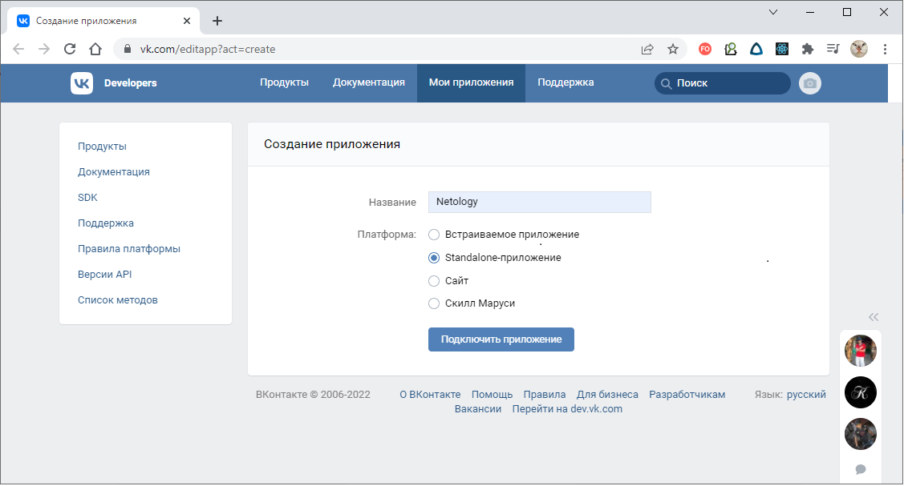
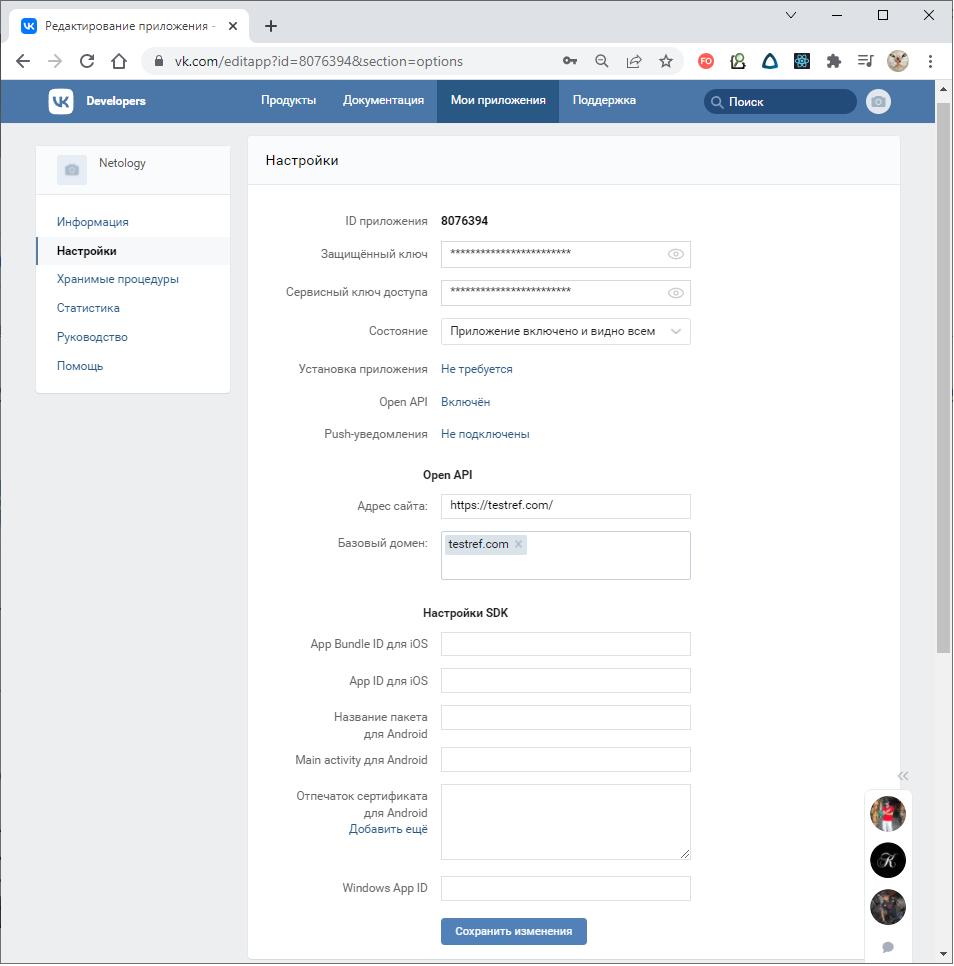
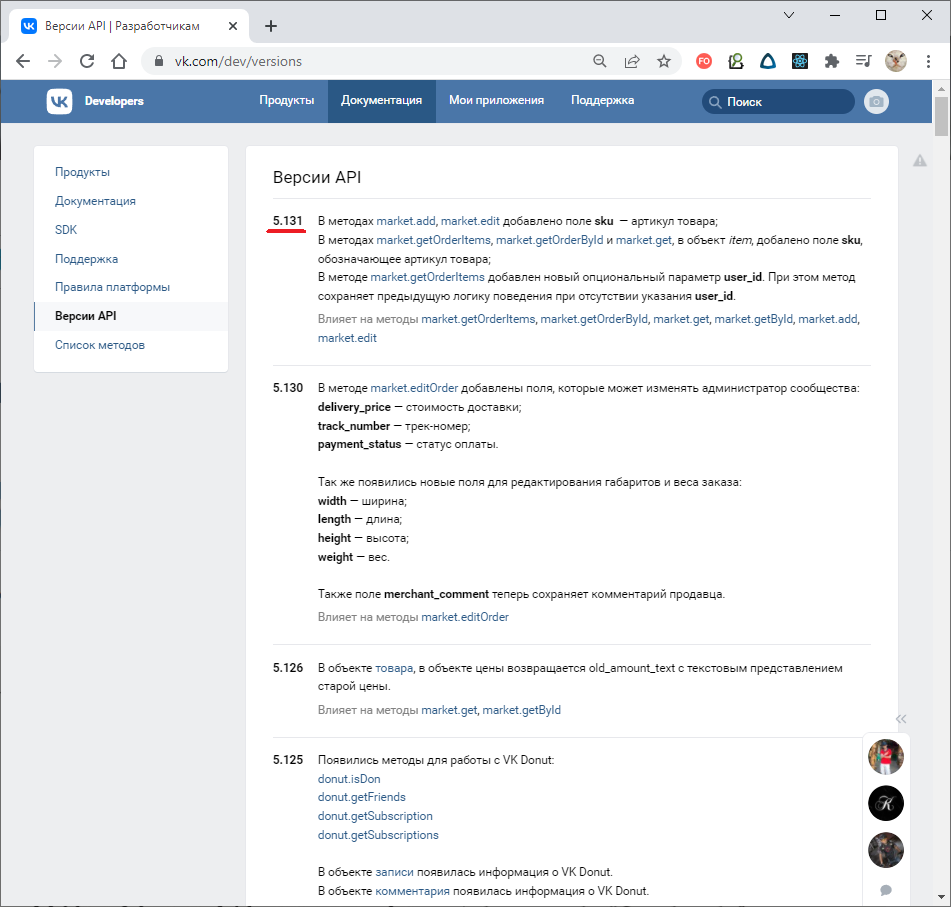
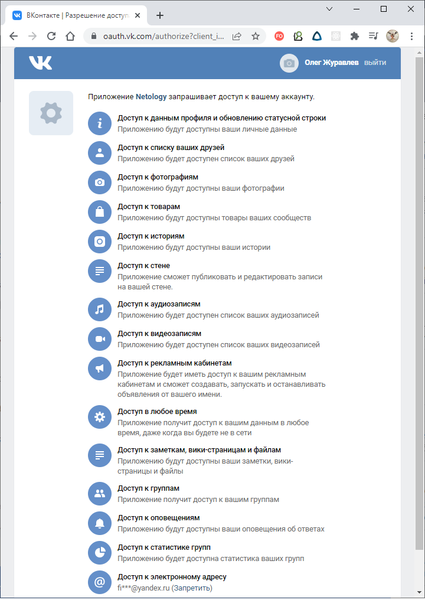
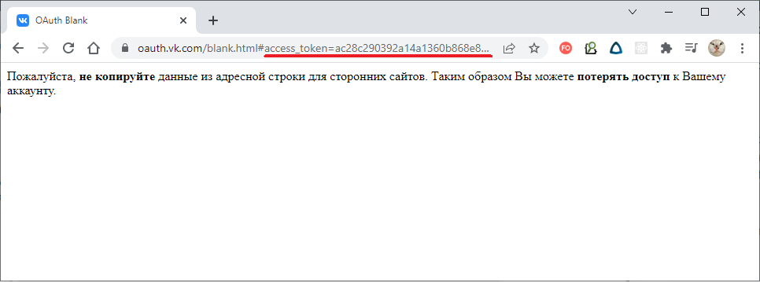

# Домашнее задание к лекции 10.«Работа с классами на примере API VK»

Вам предстоит решить задачу поиска общих друзей у пользователей VK.

Ссылка на документацию [VK/dev](https://vk.com/dev/manuals). Токен для запросов:
10b2e6b1a90a01875cfaa0d2dd307b7a73a15ceb1acf0c0f2a9e9c586f3b597815652e5c28ed8a1baf13c

---

## Задача №1

Пользователя нужно описать с помощью класса и реализовать метод поиска общих друзей, используя API VK.

===

Решение:

### Получение токена доступа

1. Регистрируемся в vk.com;
2. Заходим на https://dev.vk.com/ (https://vk.com/dev) и жмем "Создать приложение";
3. Вводим название приложения, выбираем вариант "Standalone-приложение" и жмем "Подключить приложение";

4. Через входной звонок или смс подтверждаем действие;
5. На странице приложения заходим на вкладку "Настройки", где включаем:
6. "Состояние" - "Приложение включено и видно всем";
7. "Open API" - "Включен";
8. "Адрес сайта" и "Базовый домен" вводим любые;
9. Жмем "Сохранить изменения";

10. На этой же странице приложения запоминаем информацию:
11. "ID приложения" (будет нужно для получения токена);
12. "Защищенный ключ" (потребуется подтверждение через телефон/смс);
13. "Сервисный ключ доступа" (потребуется подтверждение через телефон/смс);
14. Заходим по ссылке https://vk.com/dev/versions и запоминаем последнюю версию API - её придётся указывать во всех
    запросах;

15. Заходим по
    ссылке: https://oauth.vk.com/authorize?client_id=<ID_приложения>&display=page&scope=notify,friends,photos,audio,video,stories,pages,status,notes,messages,wall,ads,docs,groups,notifications,stats,email,market,offline&response_type=token&v=<Версия_API> (
    в ссылке вместо <ID_приложения> и <Версия_API> нужно подставить полученные ранее значения);

> :warning: Следует обратить внимание, что в вышеприведенной ссылке параметр "scope" является списком прав доступа, которые будут выданы на токен.
>
> Права доступа описаны здесь: https://vk.com/dev/permissions

16. Откроется страница с запросом на согласие предоставить запрошенные права доступа:

17. Жмем "Разрешить" и откроется страница с предупреждением:

18. СКОПИРОВАТЬ АДРЕСНУЮ СТРОКУ страницы с предупреждением - именно в ней в параметре "**access_token**" содержится
    токен!

> :warning: Если удалить созданное приложение, то доступ по данному токену станет невозможным!

19. Настройки созданного приложения находятся по адресу https://vk.com/apps?act=manage

### Использование API для поиска общих друзей

Решение:

https://github.com/olezhuravlev/devpy/blob/main/10.classes.vk/excercise1.py

---

## Задача №2

Поиск общих друзей должен происходить с помощью оператора `&`, т.е. `user1 & user2` должен выдать список общих друзей
пользователей user1 и user2, в этом списке должны быть экземпляры классов.

===

Решение:

https://github.com/olezhuravlev/devpy/blob/main/10.classes.vk/excercise1.py

---

## Задача №3

Вывод `print(user)` должен выводить ссылку на профиль пользователя в сети VK

===

Решение:

https://github.com/olezhuravlev/devpy/blob/main/10.classes.vk/excercise1.py

---